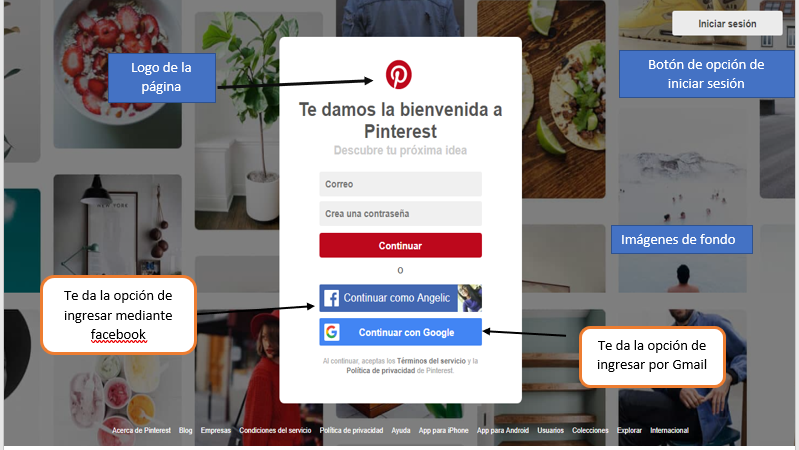
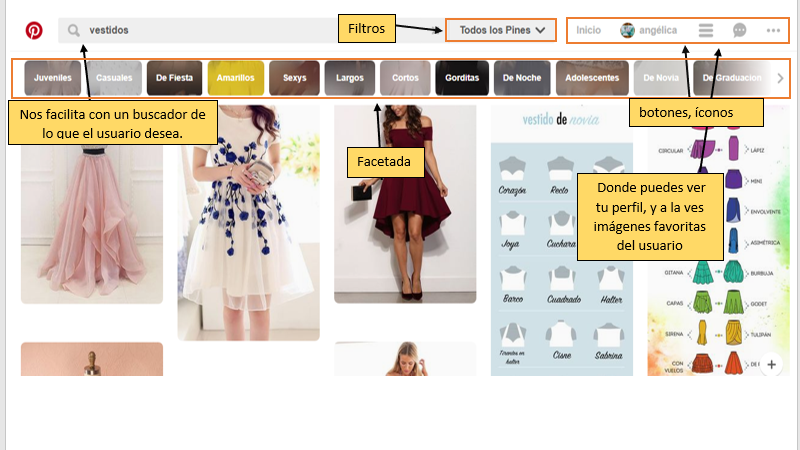
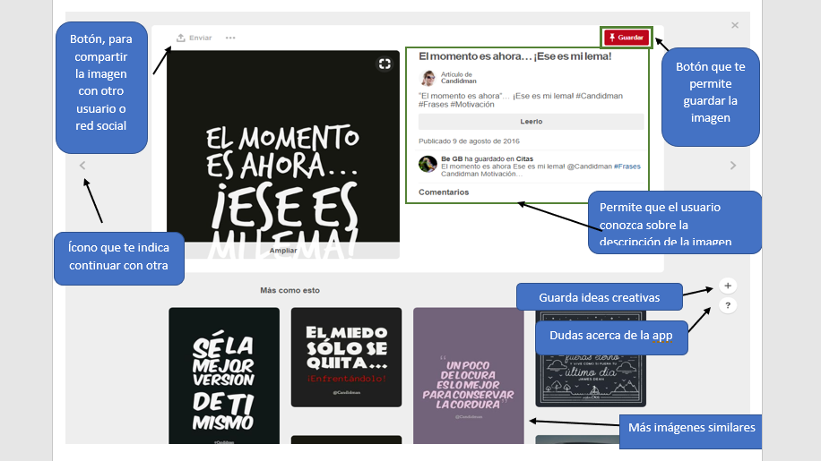

- # Reto UI-UX
 ## Objetivo
  Explica qué partes conforman el UX y qué partes el UI de la sigiente sitio web

 # ***PINTEREST***

# UI
- Tienes que ingresar con usuario de Facebook o Gmail.
- Accede rapidante a los gustos del usuario por categorias.
- Tiene opciones de guardar a una carpeta.
- Muestra múltiples imágenes con tan solo un pedido en el buscador.
- Tiene la opción de compartir

# UX
- Diseño de los botones
- El color de fondo(blanco)
- Barra de botones para, categorías, guardar, compartir, inicio, notificaciones y para -     iniciar un chat.
 - El borde de las imágenes, tamaño y calidad de imagen.

